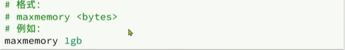

### Redis内存回收

Redis之所以性能强，最主要的原因就是基于内存存储。然而单节点的Redis2其内存大小不宜过大，会影响持久化或主从同步性能。
我们可以通过修改配置文件来设置Redis的最大内存：

#### 过期策略

在学习Redis缓存的时候我们说过，可以通过expire命令给Redisl的key设置TTL（存活时间)：

可以发现，当key的TTL到期以后，再次访问name返回的是null,说明这个key已经不存在了，对应的内存也得到释放。从而起到内存回收的目的。

这里有两个问题需要我们思考：  
①Redis,是如何知道一个key是否过期呢？
√利用两个Dict分别记录key-value对及key-ttl对  
②是不是TTL到期就立即删除了呢？  
√惰性删除
√周期删除

#### 过期策略-惰性删除

惰性删除：顾明思议并不是在TTL到期后就立刻删除，而是在访问一个ky的时候，检查该ky的存活时间，如果已经过期才执行删除。

#### 过期策略-周期删除

周期删除：顾明思议是通过一个定时任务，周期性的抽样部分过期的ky,然后执行删除。执行周期有两种：  
◆Redis会设置一个定时任务serverCron(),按照server.hz的频率来执行过期key清理，模式为SLOW  
◆Redis的每个事件循环前会调用beforeSleep()函数，执行过期key清理，模式为FAST

SLOW模式规则：  
1.执行频率受server.hz影响，默认为10，即每秒执行10次，每个执行周期100ms。  
2.执行清理耗时不超过一次执行周期的25%.  
3.逐个遍历db,逐个遍历db中的oucket,抽取20个key判断是否过期  
4.如果没达到时间上限（25ms)并且过期ky比例大于10%，再进行一次抽样，否则结束

FAST模式规则（过期key比例小于10%不执行）：  
①执行频率受beforeSleep(0调用频率影响，但两次FAST模式间隔不低于2ms  
②执行清理耗时不超过1ms  
③逐个遍历db,逐个遍历db中的oucket,抽取20个key判断是否过期  
④如果没达到时间上限（1ms)并且过期ky比例大于10%，再进行一次抽样，否则结束

#### 淘汰策略

内存淘汰：就是当Redis内存使用达到设置的阈值时，Redis主动挑选部分key删除以释放更多内存的流程。

Redis会在处理客户端命令的方法processCommand()中尝试做内存淘汰：

Redis支持8种不同策略来选择要删除的key:

* noeviction:不淘汰任何key,但是内存满时不允许写入新数据，默认就是这种策略。
* volatile-tl:对设置了TTL的key,比较key的剩余TTL值，TTL越小越先被淘汰
* allkeys-random:对全体key,随机进行淘汰。也就是直接从db->dict中随机挑选
* volatile-random:对设置了TTL的key,随机进行淘汰。也就是从db->expires中随机挑选。
* allkeys-lru:对全体key,基于LRU算法进行淘汰
* allkeys-lfu:对全体key,基于LFU算法进行淘汰
* volatile-lru:对设置了TTL的key,基于LRU算法进行淘汰
* volatile-lfu:对设置了TTL的key,基于LFI算法进行淘汰

比较容易混淆的有两个：  
√LRU(Least Recently Used),最少最近使用。用当前时间减去最后一次访问时间，这个值越大则淘汰优先级越高。   
√LFU(Least Frequently Used),最少频率使用。会统计每个key的访问频率，值越小淘汰优先级越高。

那么如何记录访问时间和访问频次呢？

Redis的数据都会被封装为RedisObject结构：

LFU的访问次数之所以叫做逻辑访问次数，是因为并不是每次ky被访问都计数，而是通过运算：

①生成0~1之间的随机数R

②计算1/(旧次数*lfu_log_factor+1),记录为P,lfu_log_factor默认为10

③如果R<P,则计数器+1，且最大不超过255

④访问次数会随时间衰减，距离上一次访问时间每隔lfu_decay_time分钟（默认1），计数器-1

淘汰策略流程图：

