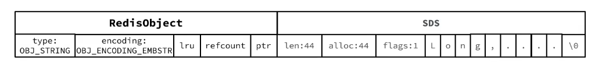

#### 动态字符串SDS

```c
struct __attribute_((__packed__))sdshdr8{
uint8_tLen;/*buf已保存的字符串字节数，不包含结束标示*/
uint8_t alloc;/*buf申请的总的字节数，不包含结束标示*/
unsigned char flags;/*不同SDS的头类型，用来控制SDS的头大小
char buf[];
};
```

具备动态扩容能力。

假如我们要给SDS追加一段字符串"，Amy”,这里首先会申请新内存空间：    
◆如果新字符串小于1M,则新空间为扩展后字符串长度的两倍+1；  
◆如果新字符串大于1M,则新空间为扩展后字符串长度+1M+1。称为内存预分配。

优点：

获取字符串长度的时间复杂度为0(1)。  
支持动态扩容。  
减少内存分配次数。  
二进制安全

#### intSet

IntSet是Redis中set集合的一种实现方式，基于整数数组来实现，并且具备长度可变、有序等特征。
结构如下：

```c
typedef struct intset{
uint32_t encoding;/*编码方式，支持存放16位、32位、64位整数*/
uint32_t length;/*元素个数*/
int8_t contents[];/*整数数组，保存集合数据*/
}intset;
```

为了方便查找，Redis会将intset中所有的整数按照升序依次保存在contents数组中，结构如图：


IntSet升级
现在，假设有一个intset,元素为{5,10,20}，采用的编码是INTSET_ENC_INT16,则每个整数占2字节：

我们向该其中添加一个数字：50000，这个数字超出了int16t的范围，intset会自动升级编码方式到合适的大小。
以当前案例来说流程如下：  
①升级编码为INTSET_ENC_INT32,每个整数占4字节，并按照新的编码方式及元素个数扩容数组  
②倒序依次将数组中的元素拷贝到扩容后的正确位置

intSet在执行插入的时候使用了**二分法**来查找要插入的下标。

#### Dict

我们知道Redis是一个键值型（Key-Value Pair)的数据库，我们可以根据键实现快速的增删改查。而键与值的映射关系正是通过Dict来实现的。

Dict由三部分组成，分别是：字典(Dict)、哈希表(DictHashTable)、哈希节点(DictEntry)、

```c
typedef struct dictht{
    //entry数组
    //数组中保存的是指向entry的指针
    dictEntry **table;
    //哈希表大小
    unsigned long size;
    //哈希表大小的掩码，总等于size-1
    unsigned long sizemask;
    //entry个数
    unsigned long used;
}dictht;
```

```c
typedef struct dictEntry{
    void*key;//键
    union
    void *val;
    uint64 t u64;
    int64_t s64;
    double d;
    }V;//值
    //下一个Entry的指针
    struct dictEntry *next;
}dictEntry;
```

```c
typedef struct dict{
    dictType*type;//dict类型内置不同的hash函数
    void *privdata;
    //私有数据，在做特殊hash运算时用
    dictht ht[2];//一个Dict包含两个哈希表，其中一个是当前数据，另一个一般是空，rehash时使用
    Long rehashidx;//rehash的进度，-l表示未进行
    intl6_t pauserehash;//rehash是否暂停，l则暂停，o则继续
}dict;
```

结构示意图


#### Dict的扩容

Dict在每次新增键值对时都会检查负载因子(LoadFactor=used/size),满足以下两种情况时会触发哈希表扩容：

* 哈希表的LoadFactor>=1,并且服务器没有执行BGSAVE或者BGREWRITEAOF等后台进程；
* 哈希表的LoadFactor>5;

Dict的rehash并不是一次性完成的。试想一下，如果Dict中包含数百万的entry,要在一次rehash完成，极有可能导致主线程阻塞。因此Dict的rehash是分多次、渐进式的完成，因此称为渐进式rehash。流程如下：

1. 计算新hash表的size,值取决于当前要做的是扩容还是收缩：
   ◆如果是扩容，则新size为第一个大于等于dict.ht[0].used+1的2^n
   ◆如果是收缩，则新size为第一个大于等于dict.ht[0].used的2^n（不得小于4)
2. 按照新的size申请内存空间，创建dictht,并赋值给dict.ht[1]
3. 设置dict.rehashidx=0,标示开始rehash
4. 每次执行新增、查询、修改、删除操作时，都检查一下dict.rehashidx是否大于-1，如果是则将dict.ht[0]table[rehashidx]的entry链表rehash到dict.ht[1],并且将rehashidx++。直至dict.ht[0]的所有数据都rehash到dict.ht[1]
5. 将dict.ht[1]赋值给dict.ht[O],给dict.ht[1]初始化为空哈希表，释放原来的dict.ht[0]的内存

#### ZipList

Z1pL1st中所有存储长度的数值均采用小端字节序，即低位字节在前，高位字节在后。例如：
数值0x1234,采用小端字节序后实际存储值为：0×3412。

因为一个指针占用8个字节，所以ZipList为了在节省空间的同时实现双向链表遍历的效果采用了如下结构：


除了entry节点，其他节点占用大小固定。

Entry的结构如下：


* previous entry_length:前一节点的长度，占1个或5个字节。
  * 如果前一节点的长度小于254字节，则采用1个字节来保存这个长度值
  * 如果前一节点的长度大于254字节，则采用5个字节来保存这个长度值，第一个字节为0xf,后四个字节才是真实长度数据
* encoding:编码属性，记录content的数据类型（字符串还是整数)以及长度，占用1个、2个或5个字
* contents:负责保存节点的数据，可以是字符串或整数

例如保存字符串“ab”和“bc”


ZipList节点数量过多，遍历的时候比较麻烦。

增加或者删除大数据时有可能发生连续更新的问题。

#### QuickList

QuickList的特点：

* 是一个节点为ZipList的双端链表
* 节点采用ZipList,解决了传统链表的内存占用问题。
* 控制了ZipList大小，解决连续内存空间申请效率问题
* 中间节点可以压缩，进一步节省了内存

结构如下图所示：


#### SkipList

SkipList的特点：

* 跳跃表是一个双向链表，每个节点都包含score和ele值
* 节点按照score值排序，score值一样则按照ele字典排序
* 每个节点都可以包含多层指针，层数是1到32之间的随机数
* 不同层指针到下一个节点的跨度不同，层级越高，跨度越大
* 增删改查效率与红黑树基本一致，实现却更简单

结构如下图所示：


### 五种数据类型

#### String


◆其基本编码方式是RAW,基于简单动态字符串(SDS)实现，存储上限为512mb。
◆如果存储的SDS长度小于44字节，则会采用EMBSTR编码，此时object head.与SDS是一段连续空间。申请内存时只需要调用一次内存分配函数，效率更高。



RedisObject占用20个字节，len，alloc,flags各占用1个字节。字符串长度占用44字节，总共占用64字节。Redis的内存分配算法是按照2的n次方来分配的，这样可以一次分配好，并且没有内存碎片。

◆如果存储的字符串是整数值，并且大小在LONG MAX范围内，则会采用INT编码：直接将数据保存在RedisObject的ptr指针位置（刚好8字节），不再需要SDS了。


#### List

* LinkedList：普通链表，可以从双端访问，内存占用较高，内存碎片较多
* ZipList：压缩列表，可以从双端访问，内存占用低，存储上限低
* QuickList:LinkedList+ZipList,可以从双端访问，内存占用较低，包含多个ZipList,存储上限高


首尾各有一个节点不做压缩，中间的的节点都会压缩。

#### Set

Set是Redis中的单列集合，满足下列特点：

* 不保证有序性
* 保证元素唯一（可以判断元素是否存在）
* 求交集、并集、差集

◆为了查询效率和唯一性，set采用HT编码(Dict)。Dict中的key用来存储元素，value统一为null。

◆当存储的所有数据都是整数，并且元素数量不超过set-max-intset-entries时，Set会采用IntSet编码，以节省内存。InSet在两种情况下会发生编码转换：1.插入数据后超过set-max-intset-entries（默认为500）2.插入了字符类型数据。

### Zset

ZSet也就是SortedSet,其中每一个元素都需要指定一个score值和member值。

* 可以根据score值排序后
* member必须唯一
* 可以根据member查询分数

因此，ZSt底层数据结构必须满足键值存储、键必须唯一、可排序这几个需求。之前学习的哪种编码结构可以满足？

* SkipList:可以排序，并且可以同时存储score和ele值(member)
* HT(Dict):可以键值存储，并且可以根据key找value

源码：


内存结构示意图：


由此可见，Zset比较占用内存。内部存储了Dict和SkipList两种结构。为了满足查询和排序。

当元素数量不多时，HT和SkipList的优势不明显，而且更耗内存。因此zSet还会采用ZipList结构来节省内存，不过需要同时满足两个条件：  
①元素数量小于zset_max_ziplist_entries,默认值128  
②每个元素都小于zset_max ziplist _value字节，默认值64。

但是ZipList本身是无序的，为了保证排序需要，在添加元素的时候需要按照顺序插入。

ziplist本身没有排序功能，而且没有键值对的概念，因此需要有zset通过编码实现：

* ZipList是连续内存，因此score和element是紧挨在一起的两个entry,element在前，score在后

* score越小越接近队首，scorei越大越接近队尾，按照score值升序排列

  

Zset初始化代码片段：可以看到有Zset和ZipList两种类型。


#### Hash

Hash结构与Redis中的Zset非常类似：

* 都是键值存储
* 都需求根据键获取值
* 键必须唯一

区别如下：

Zset的键是member,值是score；hash的键和值都是任意值
zset要根据score:排序；hash则无需排序

因此，Hash底层采用的编码与Zset也基本一致，只需要把排序有关的SkipList去掉即可：

* Hash结构默认采用ZipList编码，用以节省内存。ZipList中相邻的两个entry分别保存field和value
* 当数据量较大时，Hash结构会转为HT编码，也就是DiCt,触发条件有两个：  
  ①ZipList中的元素数量超过了hash-max-ziplist-entries(默认512)  
  ②ZipList中的任意entry大小超过了hash-max-ziplist-value(默认64字节)


思考：采用ZipList编码虽然节省内存，但是在取值的时候只能遍历来查找，所以只适用于元素数量较少的情况。


从源码看新创建的Hash默认采用ZipList编码，但是在添加元素的时候会执行判断，看是否需要转换成Dict。


注意，当ZipList大小超过1G时，也会转换编码。所以hash-max-ziplist-entries，hash-max-ziplist-value的值不建议修改。

Hash加入元素源码：

