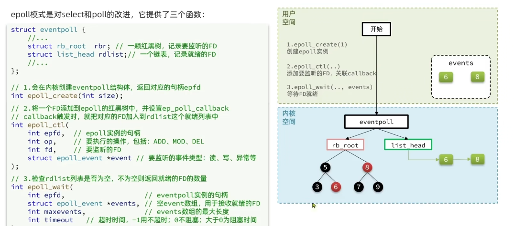
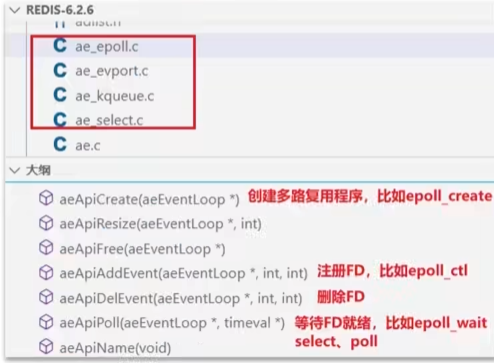
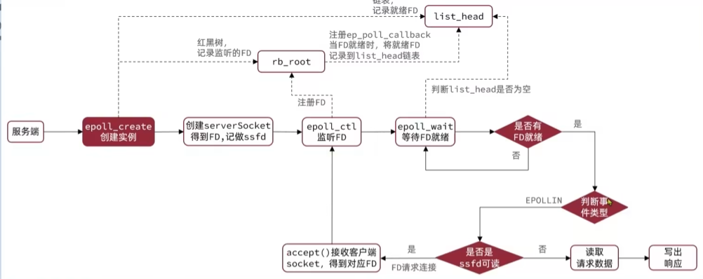
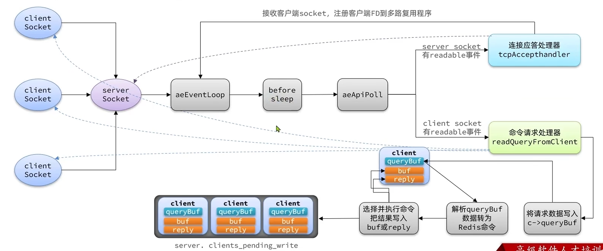
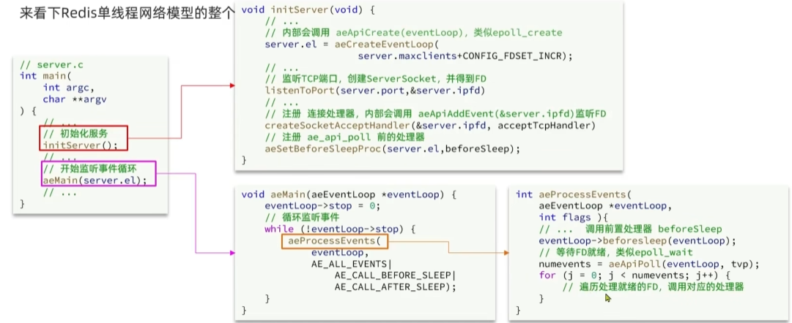
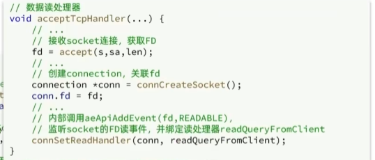
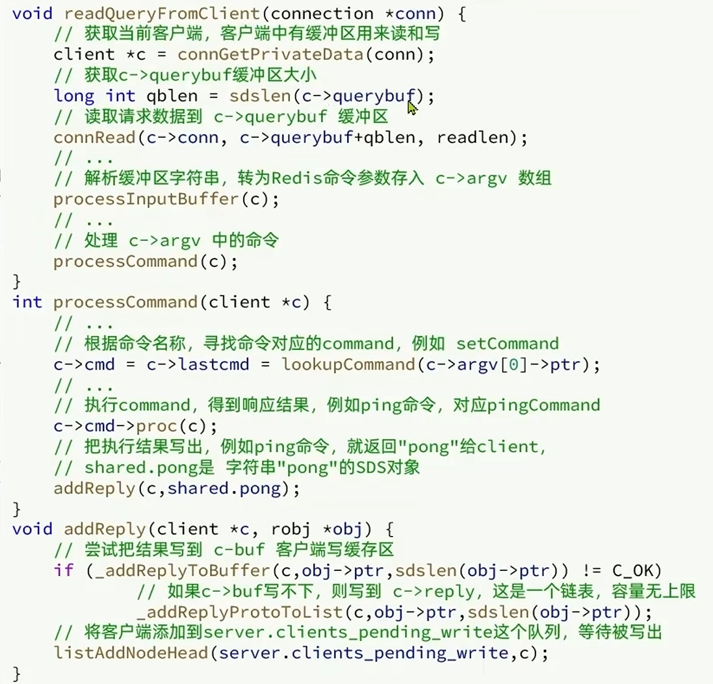
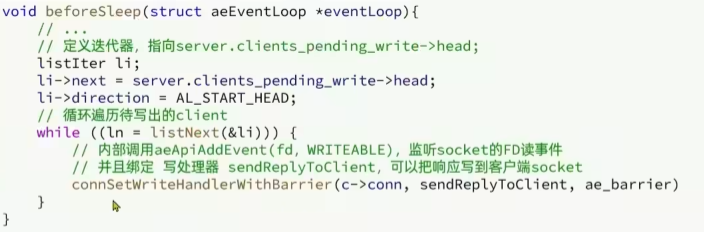

#### 用户空间和内核空间

* 进程的寻址空间会划分为两部分：**内核空间、用户空间**
* **用户空间**只能执行受限的命令(Rig3),而且不能直接调用系统资源，必须通过内核提供的接口来访问
* **内核空间**可以执行特权命令（Ring0),调用一切系统资源

写数据时，要把用户缓冲数据拷贝到内核缓冲区，然后写入设备  
读数据时，要从设备读取数据到内核缓冲区，然后拷贝到用户缓冲区

#### IO多路复用-epoll

epoll模式是对select和poll的改进，它提供了三个函数：

FD：文件描述符

select模式存在的三个问题：  
●能监听的FD最大不超过1024  
●每次select都需要把所有要监听的FD都拷贝到内核空间  
●每次都要遍历所有FD来判断就绪状态
pol模式的问题：  
●poll利用链表解决了select中监听FD上限的问题，但依然要遍历所有FD,如果监听较多，性能会下降
epoll模式中如何解决这些问题的？

* 基于epoll实例中的红黑树保存要监听的FD,理论上无上限，而且增删改查效率都非常高，性能不会随监听的FD数量增多而下降
* 每个FD只需要执行一次epoll_ctl添加到红黑树，以后每次epol_wait
  无需传递任何参数，无需重复拷贝FD到内核空间
* 内核会将就绪的FD直接拷贝到用户空间的指定位置，用户进程无需遍
  历所有FD就能知道就绪的FD是谁

#### IO多路复用-事件通知机制

当FD有数据可读时，我们调用epoll wait就可以得到通知。但是事件通知的模式有两种：
◆LevelTriggered:简称LT。当FD有数据可读时，会重复通知多次，直至数据处理完成。是Epoll的默认模式。
◆EdgeTriggered:简称ET。当FD有数据可读时，只会被通知一次，不管数据是否处理完成。可以在后续手动把就绪FD添加到list_head中。

ET模式的弊端：

1.重复通知导致性能消耗。  
2.重复通知导致惊群效应。

### Redis网络模型

Redis到底是单线程还是多线程？  
●如果仅仅聊Redis的核心业务部分（命令处理)，答案是单线程  
●如果是聊整个Redis,那么答案就是多线程

在Redis版本迭代过程中，在两个重要的时间节点上引入了多线程的支持：  
◆Redis v4.0:引入多线程异步处理一些耗时较长的任务，例如异步删除命令unlink  
◆Redis v6.0:在核心网络模型中引入多线程，进一步提高对于多核CPU的利用率

#### 为什么Redis要选择单线程？

* 抛开持久化不谈，Redis是纯内存操作，执行速度非常快，它的性能瓶颈是网络延迟而不是执行速度，因
  此多线程并不会带来巨大的性能提升。
* 多线程会导致过多的上下文切换，带来不必要的开销
* 引入多线程会面临线程安全问题，必然要引入线程锁这样的安全手段，实现复杂度增高，而且性能也会大
  打折扣

Rdis通过IO多路复用来提高网络性能，并且支持各种不同的多路复用实现，并且将这些实现进行封装，提供了统一的高性能事件库API库AE:

epoll服务端接收请求处理请求的流程：

Redis单线程网络模型的整个流程：

Rdis6.0版本中引入了多线程，目的是为了提高1O读写效率。因此在解析客户端命令、写响应结果时采用了多线程。核心的命令执行、IO多路复用模块依然是由主线程执行。注意在aeApiPoll(即epoll_wait)执行了before sleep,此操作是为了等待客户端FD就绪后将结果写回

对应server.c等部分源码：

服务端数据处理器 acceptTcpHandler

客户端请求处理器：监听的是客户端readable事件

before sleep监听客户端写事件就绪，绑定写处理器sendReplyToClient：

